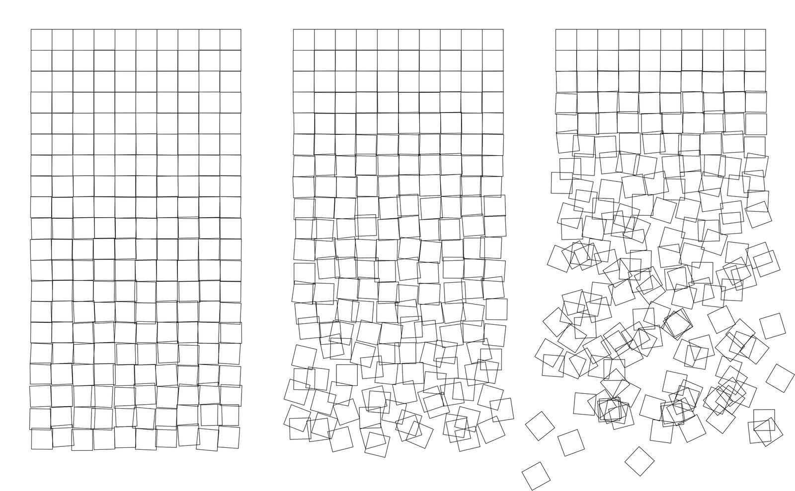
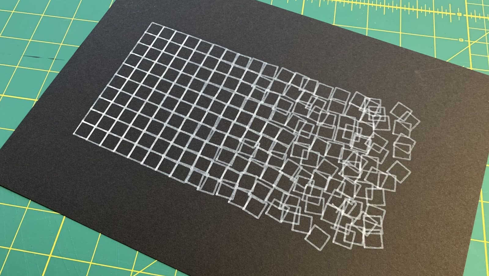

<p align="center"></a></p>

<p align="center">
  <a href="https://goreportcard.com/report/github.com/tja/schotter"></a>
  <a href="https://github.com/tja/schotter/blob/master/LICENSE"></a>
</p>

# Schotter

**Schotter** will generate line art inspired by [Georg Nees](https://en.wikipedia.org/wiki/Georg_Nees)' graphic
[*Gravel*](https://collections.vam.ac.uk/item/O221321/schotter-print-nees-georg/) (*Schotter* in German). The
resulting SVG images can be used to drive a plotter &mdash; such as [Evil Mad Scientist's
AxiDraw](https://axidraw.com) &mdash; to create beautiful pieces of art.

<p align="center"></a></p>

## Installation

Pre-built binaries are available on the [release page](https://github.com/tja/schotter/releases/latest). Simply
download, make executable, and move it to a folder in your `PATH`:

```bash
curl -L https://github.com/tja/schotter/releases/download/v1.0.0/schotter-`uname -s`-`uname -m` >/tmp/schotter
chmod +x /tmp/schotter
sudo mv /tmp/schotter /usr/local/bin/schotter
```

## Usage

To generate a new image named `sample.svg` Run Schotter like this:

```bash
schotter sample.svg
```

Run `schotter --help` to see the list of available options.

## License

Copyright (c) 2018 Thomas Jansen. Released under the
[MIT License](https://github.com/tja/schotter/blob/master/LICENSE).
